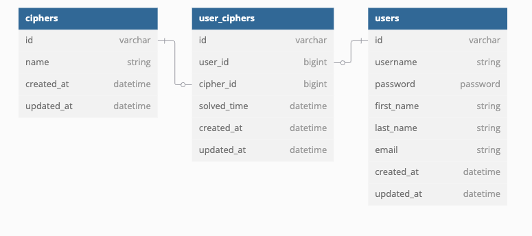

# Cipher Genius

This is a web based cipher based puzzle game. You can create an account and it will track the number of ciphers you have solved in each category and the time it took to solve the cipher. If you don't want to create an account you have the option to continue as a guest as solve cipher puzzles.


## Deployed Site
- Coming soon

## Front End Repo
[Front End Repo](https://github.com/MiTOBrien/cipher_genius_fe/tree/main)

## Technology Used
* Ruby 3.2.3
* Rails 7.1.5
* PostgresSQL 1.1

### Gems
* devise
* devise-jwt
* jsonapi serializer
* RSpec 7.0.0
* shoulda-matchers
* Factorybot
* simplecov
* Pry

## Getting Started
To run this locally clone this repository onto your local machine. Change directory into the cipher-genius-be directory and install all dependiences:
```
bundle install
```

To launch the backend server:
```sh
rails server (or rails s)
```

To see the application fully functioning you will also need to clone down the front end repository and run that as well.

## Database creation and setup
To quickly set up the database from the command line:
```sh
rails db:{drop,create,migrate,seed} or rails db:reset
```

## Routes/Endpoints
### users
- Register        - /signup
- Login           - /login
- Logout          - /logout
- Forgot password - /password
- Update profile  - /api/v1/users/update

### user_ciphers - to track and retrieve game statistics
- post  - /api/v1/user_ciphers/create
- get   - /api/v1/user_ciphers



## Testing Suite
* RSpec

To run the RSpec tests from the command prompt run:
```sh
bundle exec rspec spec
```